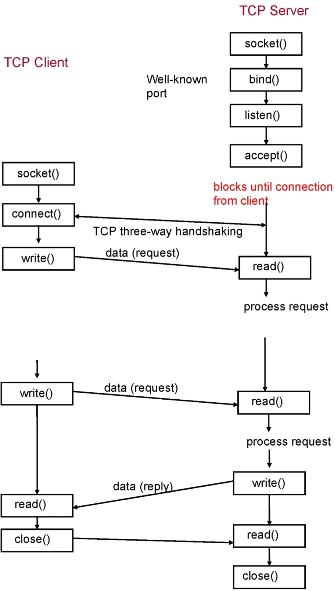

# 2️⃣ 애플리케이션 계층 & 전송계층

 

## Socket

### Socket이란?

: application 계층과 network 계층 사이에 있는 interface

- application에서 socket을 생성

- socket의 type 

  reliable vs. best effort

  **connection-oriented(TCP)** vs. **connectionless(UDP)**

- 

- socket으로 데이터를 넘겨주거나, 다른 host에서 전송한 데이터를 socket으로부터 받아옴

 

### Types of Socket

1. SOCK_STREAM (= TCP)
   - 신뢰성있는 전송
   - 순차적 전송
   - connection-oriented
   - 양방향
2. SOCK_DGRAM (=UDP)
   - 신뢰성↓
   - 순차적x
   - 각 packet별로 목적지 정보를 담고 있음 (connection x)
   - send / receive 가능

 

### Socket Functions (TCP case)

- bind() : socket을 특정 port와 연결
- accept() : client로부터 요청을 받을 준비 완료
- connect() : server의 process와 연결

 

### Socket creation and setup

<sys/socket.h> 라이브러리를 활용한 socket 생성 3단계

​	: **(1) Create	(2) Bind	(3) Accept** 

1. Create

   `int socket(int domain, int type, int protocol);`

   해당 소켓을 가르키는 socket descripter(생성된 socket의 id)를 반환

   ​	-1이 반환되면 socket 생성 실패

   ​	0 이상의 값이 나오면 socket descripter 반환

   type : TCP / UDP socket 설정

   ​		TCP - **SOCK_STREAM**

   ​		UDP - **SOCK_DGRAM**

2. Bind

   `int bind(int sockfd, struct sockaddr* myaddr, int addrlen);`

   소켓을 local IP 주소와 port number에 연결

   ▶ 왜 client는 bind를 사용하지 않을까?

   ​		bind 는 socket과 port를 연결하는데, client는 아무 port나 사용하면 되기 때문

   - listen

     `int listen(int sockfd, int backlog)`

     server 쪽의 socket을 connection mode로 설정

     몇 개의 request를 queue에 담아 처리할지를 설정

3. Accept

   `int accept(int sockfd, struct sockaddr* cliaddr, int* addrlen);`

   server 쪽의 socket이 connection queue의 request를 받을 수 있도록 설정

   server와 client를 연결

   cliaddr : client 의 ip 주소와 port number

 

## Transport Layer

### Multiplexing / Demultiplexing

1. Multiplexing **(Sender)**

   다수의 socket으로부터 데이터를 모아서 header를 추가하여 segment을 생성

2. Demultiplexing **(Reciever)**

   받은 segment를 알맞는 socket으로 전송

   socket의 header에 포함된 정보를 가지고 전달할 process 설정

 

→ Segment 의 구성 : **header + data(message)**

​	heder field 에는 source port number 와 destination port number 가 포함되어 있음

​	host는 IP 주소와 port number를 활용하여 segment를 전송할 socket을 결정

 

### TCP와 UDP Demultiplexing 비교

1. TCP Demux

   source IP	/	source port num	/	destination IP	/	destination port num

   4가지 정보를 가지고 전송할 socket 결정

   데이터를 보내려는 process가 같아도, SP, DP, S-IP, D-IP 값에 따라 다른 socket으로 보내짐

2. UDP Demux

   destination IP	/	destination port num

   2가지 정보만을 가지고 전송할 socket 결정

   데이터를 보내려는 process가 같다면 같은 socket으로 보내짐

 

### Connectionless transport : UDP

- connectionless → 각각의 UDP segment들은 독립적

-  UDP 사용 이유?

  → sender와 receiver에 connection이 없기 때문에 단순함

  → segment의 header 부분이 최소화되어 있음

  → 혼잡도↓

- UDP segment 의 구성

  : header(**source port num** / **destination port num** / length / **checksum**) + data(message)

  → header가 4개의 field로 구성

  → 한 field 당 16bit, 약 6만개의 port num 표현 가능

  → checksum : 전송 중 error 발생 여부를 판단하는 역할, error 발생 시 message drop

  ▶ **UDP 역할 (1) multiplexing / demultiplexing	(2) error check**

  ​		→ UDP로 message를 수신한 경우? error가 발생하지 않았음을 의미

 

### Principles of reliable data transfer

데이터가 전송되는 과정은 unreliable 환경 (ex. router에서 packet loss 등)

application에서 전송하는 데이터가 유실되지 않고 전송될 수 있도록 design

​	→ 오직 stop-and-wait protocol 만 고려

데이터 전송 과정에서 발생할 수 있는 오류? **(1) Message Error	(2) Message Loss**

1. Packet error 발생하는 경우 (No loss)

   : **Error detection	/	Feedback	/	retransmission	/	sequence number**

   ① checksum 비트를 활용하여 **error detection** → packet error 확인

   ② sender에게 packet을 잘 받았는지, 아닌지 **feedback** 전송

   ​	(1) ACK : packet을 정상적으로 받았을 때

   ​	(2) NAK : packet에 오류가 있음을 알릴 때

   ③ NAK를 받은 sender는 해당 packet을 **재전송**

   ▶ ACK와 NAK 에 error가 발생한다면?

   ​		→ 전송된 packet이 새로운 데이터인지, 이전과 중복된 데이터인지 확인 필요

   ​		→ sender가 각 packet 의 header 에 **sequence number를 추가**하여 전송

   ​		→ sequence number : 현재 다루는 내용에서는 0, 1만 사용하기 때문에 1bit로 표현

   ​	① sender : packet header 에 sequence number 추가하여 전송

   ​	② receiver : 받은 packet이 중복된 내용인지 확인하고, feedback 전송

   ​						packet을 받지 못했다면 NAK, 그 외의 경우에는 ACK 전송

   ​	③ sender : receiver로부터 받은 feedback 확인

   ​						NAK 이거나 feedback을 못 받은 경우 packet 재전송

2. Message loss 발생하는 경우

   :  **Timer**

   → 적절한 시간으로 설정

   ▶ Timer 시간을 정확한 수치로 설정하기 어려운 이유?

   ​		→ trade off가 존재하기 때문

   ​		→ timer가 짧은 경우?

   ​				(장점) loss 발생 시 recovery 빠르게 가능

   ​				(단점) network overhead 발생

   ​				 		feedback을 받기 전에 packet을 재전송해서 중복된 packet이 발생

   ​		→ timer가 긴 경우?

   ​				(장점) network overhead 발생 ↓

   ​				(단점) loss 발생 시 반응이 늦음

 

