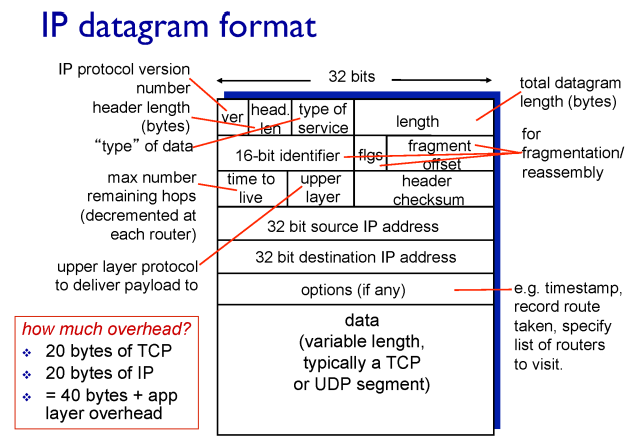

# Review

## Chapter 1

- Internet
  - 패킷 기반의 통신
  - 데이터가 패킷 단위로 나누어져 네트워크 core에 있는 라우터가 패킷을 인식한 뒤 패킷별로 처리
- 라우터에 일정 시간 내에 처리할 수 있는 데이터 양보다 더 많은 데이터가 들어오게 된 경우 문제 발생
  - 라우터에 패킷이 임시로 저장될 수 있는 공간(큐)을 마련 → queuing delay 발생(현재 인터넷에서 발생하는 딜레이의 가장 큰 원인)
  - 큐에 들어가지 못한 패킷의 경우 → packet drop → packet loss의 가장 큰 이유
- delay 종류
  - **processing**
  - **queuing**
  - **transmission**
  - **propagation**

 

## Chapter 2

- HTTP 프로토콜 → 메세지 2종류(request, response)
- TCP → application 프로토콜, transport의 서비스를 받아야 함, reliable 전송 가능
- HTTP 종류
  - **Non-persistent** : 매번 request 할 때마다 다른 TCP connection 사용
  - **persistent** : 한 번 연결한 connection 계속 사용(재사용) → HTTP에서 default

 

## Chapter 3

- transport layer → UDP, TCP 프로토콜

- **UDP**

  - header : field 4개(source port #, dest port #, length, checksum)

- **TCP**

  - reliable data transfer 제공

  - 발생 가능한 문제

    - **packet error**

      (1) error detection (2) feedback (3) retransmit

      → 재전송 시, 새로운 패킷과 기존의 패킷 구별하기 위해서 sequence number 사용

    - **packet loss**

      → timeout 매커니즘 사용

  - pipeline 방식을 실제 인터넷에서 사용 중

    - 구현 방법

      (1) **go - back - N**

      ​	장점 : 단순한 구조, 단순한 동작(타이머 하나 사용하기 때문)

      ​	단점 : 큰 overhead (패킷 유실 시, 윈도우 안에 들어있는 패킷을 모두 재전송하기 때문)

      (2) **selective repeat**

      ​	장점 : 구현의 어려움(유실된 패킷만 재전송하기 때문), 큰 저장공간 요구, 패킷마다 타이머 필요

  - 특징

    - point-to-point
    - reliable
    - pipelined
    - send & receive buffers
    - full duplex data
    - connection-oriented
    - flow controlled

  - **Fast Retransmit**

    - sender가 중복된 ACK를 3개 연속으로 받는다면 packet loss라고 생각하고 재전송

  - **Congestion Control**

    (1) Slow start (2) Additive increase (3) multiplicative decrease

 

# 5️⃣ 네트워크 계층 1

## Introduction & Router

- Network layer

  - 라우터에서 packet의 header를 보고 목적지 분석, 어떤 경로로 packet을 보낼지 결정

  - 라우터의 기능

    1. **forwarding**

       라우터의 input에서 적절한 output으로 packet을 이동시킴

       packet의 header를 보고 목적지를 파악, forwarding table을 참고하여 packet을 어디로 전달할지를 결정

       forwarding table은 라우팅 알고리즘을 통해 자동적으로 생성되며, table은 주소를 범위로 나누어 구성되어 있음

       - **Longest prefix matching**

         forwarding table 에서 패킷의 목적지 주소와 부합하는 가장 긴 address prefix 선택

    2.  **routing**

       packet의 목적지까지의 경로를 결정함

 

## IP : Internet Protocol

### IP datagram format

- time to live(TTL)

  : 라우터를 거칠 때마다 값이 1씩 감소되며 0이 되는 순간 해당 패킷을 버림

  : 혹시 모를 루프를 방지하여 한정 시간동안만 네트워크에 존재하다 사라지므로 트래픽을 줄일 수 있음

- upper layer

  : data에 들어가는 것이 TCP인지 UDP인지 구분할 수 있도록 함

​	→ IP packet header의 크기 20bytes, TCP 또한 20bytes

​	→ TCP segment를 담은 packet(TCP packet) header의 크기는 20~40bytes, 나머지는 메세지

​	→ 즉, application message에 40 bytes의 overhead가 덧붙여서 전송됨

​	→ 인터넷에서 40bytes의 패킷은 ACK만 담긴 패킷을 의미

 

### IP Address (IPv4)

- 호스트(네트워크 인터페이스)를 지칭하는 주소

- 32bit 주소 체계 → 2의 32제곱 만큼의 ip 주소를 가질 수 있음

- 8bit씩 끊어서 10진수로 변환하여 읽음, 한 단위의 최대값은 255임

- 네트워크 인터페이스를 여러개 가지고 있어 ip 주소가 여러개인 것은? → 라우터

- Subnet mask : ip 주소랑 항상 같이 전달되고, 네트워크 ip가 몇 비트인지를 알 수 있게 함

- **CIDR (Classless InterDomain Routing)**

  - address 형식 : a.b.c.d/x

    x는 주소에서 subnet 부분의 비트 수

- Subnet

  - IP주소의 subnet part가 동일한 디바이스의 집합
  - 라우터를 거치지 않고 도달 가능

 